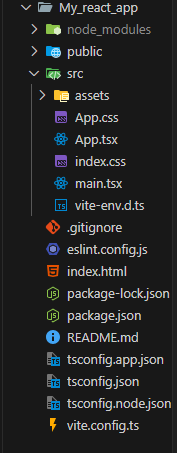

# ⚛️ React

```
    Yahyaoui Med Aziz  | 05242025
    Editor: VsCode
    Definitions: ChatGPT
   
``` 

<details>
<summary>Other resources:</summary>


   - 🔗 [React.dev](https://react.dev/blog/2023/03/16/introducing-react-dev)
   - 🔗 [Vite.dev](https://vite.dev/guide/)
</details>

---

## **Introduction to React**

Welcome to **Hello React ⚛️!**, your first step into the world of modern front-end development.

---

## 🧠 What is React?

**React** is a JavaScript library for building user interfaces, created and maintained by **Meta (Facebook)**.

It allows developers to build reusable UI components and manage the state of dynamic interfaces efficiently.

> Think of it as Lego for building interactive websites.

---

## 🧩 Why React?

- ✅ **Component-based**: Break UI into independent, reusable pieces.
- ⚡ **Fast & Lightweight**: Uses a virtual DOM for fast rendering.
- 📦 **Ecosystem**: Backed by a huge community and tooling.
- 🔁 **Reusable logic**: Through hooks and components.
- 🧭 **Declarative**: Describe *what* you want, not *how* to do it.

---

## 📌 Real-World Usage

React powers many major apps and sites, like:

- Facebook
- Instagram
- Netflix
- WhatsApp Web
- Airbnb
- GitHub (partially)

---

## 🛠️ What You Need Before Starting

Make sure you're comfortable with:

- ✅ Basic **HTML** & **CSS**
- ✅ Basic **JavaScript (ES6+)**
- ✅ Using **VS Code** or any editor
- ✅ Git + GitHub (for tracking and sharing your work)

> Tip: You don’t need to master everything. You’ll pick up a lot along the way.

---

## ⚙️ React Setup in 60 Seconds

- Install Node.js from [https://nodejs.org](https://nodejs.org)
- Then use **Vite** to quickly spin up a React project.

## ⚡ Vite: The Modern Build Tool

**Vite** is a **next-generation frontend tooling** system that’s become the go-to for modern React, Vue, and other JavaScript frameworks.

Unlike older tools like Webpack, Vite is fast — like *really* fast — thanks to native **ES Modules** and **instant hot module replacement (HMR)**.

### 🚀 Why Vite over Create React App (CRA)?

| Feature                   | Create React App (CRA) | Vite ⚡ |
|---------------------------|------------------------|--------|
| Startup Time              | ⏳ Slower               | ⚡ Instant |
| Build Speed               | 🐢 Moderate             | 🏎️ Super fast |
| Configuration             | 🔒 Opinionated          | 🔓 Flexible |
| Community + Modern Tools | ✅ Good                 | ✅ Excellent |
| HMR (Hot Reloading)       | Basic                  | Instant |

> In short: Vite is CRA’s cooler, faster cousin. Once you switch, you won’t go back 😎

### 🧰 What's Under the Hood?

- Dev server powered by **native ESM**
- Instant rebuilds during development
- Support for **TypeScript**, **JSX**, **React Fast Refresh**
- Easy plugin ecosystem

---

### ⚓ lets start:

```bash
npm create vite@latest my-react-app -- --template react
cd my-react-app
npm install
npm run dev
```
---

- Visit `http://localhost:5173` — boom! You’re in.

<details>
<summary>🛠️ And for security reasons, using the default port is usually considered bad practice. To use a custom port like <code>5050</code>, here's how!</summary>


Edit or create a file named <code>vite.config.js</code> in your project root:

```js
// vite.config.js
import { defineConfig } from 'vite'
import react from '@vitejs/plugin-react'

export default defineConfig({
  plugins: [react()],
  server: {
    port: 5050, // 👈 Use your desired port
  },
})
```

Then run:

```bash
npm run dev
```

Your app will now run at:
👉 `http://localhost:5050`

And for more security
</details>


---

## 🗂️ Vite + React Project Structure

Let's break down the **Vite + React** project structure.

---



---

## 🗂️ What's Inside a Vite + React App?

After you run:

```bash
npm create vite@latest my-react-app -- --template react-ts

```

Vite scaffolds a clean, minimal structure. Let’s break it down, folder by folder and file by file:

---

### 📁 node\_modules/

> ⚙️ Contains **all the dependencies** your project needs (like React, Vite, ESLint).
> 📦 Auto-generated by `npm install`.

You *never* touch this manually. It's your app’s toolbox.

---

### 📁 public/

> 🌍 Static files (like images, favicons, or robots.txt) that **don’t go through Vite’s processing**.

Anything in this folder is served **as-is** at the root path.

---

### 📁 src/

> 🧠 This is **where you code lives**. It’s your workspace.

* **📁 assets/**
  Your images, icons, or static resources that are used inside components.

* **`App.tsx`**
  The 🧱 main component — kind of like your homepage layout.

* **`App.css`**
  Styles for your `App.tsx`. Feel free to change it or replace with something like Tailwind.

* **`index.css`**
  Global CSS applied to the entire app.

* **`main.tsx`**
  The 🚪 entry point. It renders `App` and mounts it to `index.html`.

* **`vite-env.d.ts`**
  Vite-specific TypeScript types (you usually don’t touch this unless extending Vite).

---

### 📄 index.html (root level)

> 🧾 The base HTML that Vite uses as your entry page.

Inside it you’ll find a `<div id="root"></div>` — this is where React renders the app.

---

### 📄 vite.config.ts

> ⚙️ Vite’s configuration file. Here you set ports, aliases, plugins, etc.

Example tweak: change port from default `5173` to `5050`.

---

### 📄 package.json

> 🧬 Describes your project: scripts, dependencies, metadata.

This is where `npm run dev`, `npm install`, etc. come from.

---

### 📄 tsconfig.\*.json

> 📐 TypeScript configuration files.

* `tsconfig.json` is the base.
* `tsconfig.app.json` is for your app code.
* `tsconfig.node.json` is for Node/Vite tooling.

---

### 📄 .gitignore

> 🧹 Tells Git what to ignore (like `node_modules`, `.env`, etc.).

---

### 📄 eslint.config.js

> 🔍 Linting config — keeps your code style clean and bug-free.

---

### 📄 README.md

> 📘 Your project documentation. Always update this!

---

📎 **TL;DR:**
Everything is neatly separated. You build your app in `src/`, serve raw files from `public/`, and tweak behavior from `vite.config.ts` or `package.json`.

Once you get comfy here, React starts to feel like home 🏠

