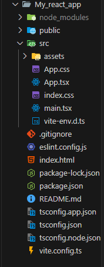

# ⚛️ React

```
    Yahyaoui Med Aziz  | 05242025
    Editor: VsCode
    Definitions: ChatGPT + Official documentations

```

<details>
<summary>Other resources:</summary>

- 🔗 [React.dev](https://react.dev/blog/2023/03/16/introducing-react-dev)
- 🔗 [Vite.dev](https://vite.dev/guide/)
</details>

---

## **Introduction to React**

Welcome to **Hello React ⚛️!**, your first step into the world of modern front-end development.

---

### 🧠 What is React?

**React** is a JavaScript library for building user interfaces, created and maintained by **Meta (Facebook)**.

It allows developers to build reusable UI components and manage the state of dynamic interfaces efficiently.

> Think of it as Lego for building interactive websites.

---

### 🧩 Why React?

- ✅ **Component-based**: Break UI into independent, reusable pieces.
- ⚡ **Fast & Lightweight**: Uses a virtual DOM for fast rendering.
- 📦 **Ecosystem**: Backed by a huge community and tooling.
- 🔁 **Reusable logic**: Through hooks and components.
- 🧭 **Declarative**: Describe _what_ you want, not _how_ to do it.

---

### 📌 Real-World Usage

React powers many major apps and sites, like:

- Facebook
- Instagram
- Netflix
- WhatsApp Web
- Airbnb
- GitHub (partially)

---

### 🛠️ What You Need Before Starting

Make sure you're comfortable with:

- ✅ Basic **HTML** & **CSS**
- ✅ Basic **JavaScript (ES6+)**
- ✅ Using **VS Code** or any editor
- ✅ Git + GitHub (for tracking and sharing your work)

> Tip: You don’t need to master everything. You’ll pick up a lot along the way.

---

## ⚙️ React Setup using Vite with TypeScript & Tailwind

- Install Node.js from [https://nodejs.org](https://nodejs.org)
- Then use **Vite** to quickly spin up a React project.

### ⚡ Vite: The Modern Build Tool

**Vite** is a **next-generation frontend tooling** system that’s become the go-to for modern React, Vue, and other JavaScript frameworks.

Unlike older tools like Webpack, Vite is fast — like _really_ fast — thanks to native **ES Modules** and **instant hot module replacement (HMR)**.

#### 🚀 Why Vite over Create React App (CRA)?

| Feature                  | Create React App (CRA) | Vite ⚡       |
| ------------------------ | ---------------------- | ------------- |
| Startup Time             | ⏳ Slower              | ⚡ Instant    |
| Build Speed              | 🐢 Moderate            | 🏎️ Super fast |
| Configuration            | 🔒 Opinionated         | 🔓 Flexible   |
| Community + Modern Tools | ✅ Good                | ✅ Excellent  |
| HMR (Hot Reloading)      | Basic                  | Instant       |

> In short: Vite is CRA’s cooler, faster cousin. Once you switch, you won’t go back 😎

#### 🧰 What's Under the Hood?

- Dev server powered by **native ESM**
- Instant rebuilds during development
- Support for **TypeScript**, **JSX**, **React Fast Refresh**
- Easy plugin ecosystem

---

## ⚓ lets start:

```bash
npm create vite@latest my-react-app -- --template react-ts
cd my-react-app
npm install
npm run dev
```

---

- Visit `http://localhost:5173` — boom! You’re in.

<details>
<summary>🛠️ And for security reasons, using the default port is usually considered bad practice. To use a custom port like <code>5050</code>, here's how!</summary>

Edit or create a file named <code>vite.config.js</code> in your project root:

```js
// vite.config.js
import { defineConfig } from "vite";
import react from "@vitejs/plugin-react";

export default defineConfig({
  plugins: [react()],
  server: {
    port: 5050, // 👈 Use your desired port
  },
});
```

Then run:

```bash
npm run dev
```

Your app will now run at:
👉 `http://localhost:5050`

And for more security

</details>

---

### 🗂️ Vite + React Project Structure

Let's break down the **Vite + React** project structure.

---



---

### 🗂️ What's Inside a Vite + React App?

After you run:

```bash
npm create vite@latest my-react-app -- --template react-ts

```

Vite scaffolds a clean, minimal structure. Let’s break it down, folder by folder and file by file:

---

#### 📁 node_modules/

> ⚙️ Contains **all the dependencies** your project needs (like React, Vite, ESLint).
> 📦 Auto-generated by `npm install`.

You _never_ touch this manually. It's your app’s toolbox.

---

#### 📁 public/

> 🌍 Static files (like images, favicons, or robots.txt) that **don’t go through Vite’s processing**.

Anything in this folder is served **as-is** at the root path.

---

#### 📁 src/

> 🧠 This is **where you code lives**. It’s your workspace.

- **📁 assets/**
  Your images, icons, or static resources that are used inside components.

- **`App.tsx`**
  The 🧱 main component — kind of like your homepage layout.

- **`App.css`**
  Styles for your `App.tsx`. Feel free to change it or replace with something like Tailwind.

- **`index.css`**
  Global CSS applied to the entire app.

- **`main.tsx`**
  The 🚪 entry point. It renders `App` and mounts it to `index.html`.

- **`vite-env.d.ts`**
  Vite-specific TypeScript types (you usually don’t touch this unless extending Vite).

---

#### 📄 index.html (root level)

> 🧾 The base HTML that Vite uses as your entry page.

Inside it you’ll find a `<div id="root"></div>` — this is where React renders the app.

---

#### 📄 vite.config.ts

> ⚙️ Vite’s configuration file. Here you set ports, aliases, plugins, etc.

Example tweak: change port from default `5173` to `5050`.

---

#### 📄 package.json

> 🧬 Describes your project: scripts, dependencies, metadata.

This is where `npm run dev`, `npm install`, etc. come from.

---

#### 📄 tsconfig.\*.json

> 📐 TypeScript configuration files.

- `tsconfig.json` is the base.
- `tsconfig.app.json` is for your app code.
- `tsconfig.node.json` is for Node/Vite tooling.

---

#### 📄 .gitignore

> 🧹 Tells Git what to ignore (like `node_modules`, `.env`, etc.).

---

#### 📄 eslint.config.js

> 🔍 Linting config — keeps your code style clean and bug-free.

---

#### 📄 README.md

> 📘 Your project documentation. Always update this!

---

📎 **To wrap-up**
Everything is neatly separated. You build your app in `src/`, serve raw files from `public/`, and tweak behavior from `vite.config.ts` or `package.json`.

Once you get comfy here, React starts to feel like home 🏠

---

## ⚙️ React Under the Hood: Lifecycle Boot Sequence

Ever wondered what happens when you run:

```bash
npm run dev
```

Let’s break it down like engineers 👷‍♂️🧠 — no breadcrumbs left behind.😜

---

### 🛠️ 1. `main.tsx` – The True Entry Point

```tsx
// src/main.tsx
import React from 'react';
import ReactDOM from 'react-dom/client';
import App from './App.tsx';
import './index.css';

ReactDOM.createRoot(document.getElementById('root')!).render(
  <React.StrictMode>
    <App />
  </React.StrictMode>,
);
```

#### What it does:

* Mounts the React app to `index.html` via `<div id="root">`
* Wraps everything inside `<React.StrictMode>` (optional but helpful)
* Loads the `App.tsx` component to start rendering your UI tree

---

### 🧩 2. `App.tsx` – Root of All Components

```tsx
// src/App.tsx
import Header from './components/Header';

function App() {
  return (
    <>
      <Header />
      <main>Welcome to my app!</main>
    </>
  );
}
```

This is where **you start composing components** — everything flows from here.

---

### 🧱 3. `index.html` – The Host Shell

```html
<!-- public/index.html -->
<!DOCTYPE html>
<html lang="en">
  <head>
    <meta charset="UTF-8" />
    <title>My App</title>
  </head>
  <body>
    <div id="root"></div>
    <!-- Vite injects JS + CSS here -->
  </body>
</html>
```

React doesn’t render the full HTML page — just mounts inside the `#root` div.

---

### 🧬 Lifecycle Flow Diagram

```text
npm run dev ─▶ main.tsx
               └▶ App.tsx
                   └▶ Header.tsx, Footer.tsx, Router.tsx ...
```

---

### ✅ Summary Table

| File         | Purpose                            |
| ------------ | ---------------------------------- |
| `main.tsx`   | Entry point that renders the app   |
| `App.tsx`    | Root component holding the UI tree |
| `index.html` | HTML shell where React mounts      |
| `index.css`  | Optional global styles             |

---

### 🚀 **Add TailwindCSS v4 with Vite**

📘 **Official Resources**:

- [Tailwind with Vite Guide](https://tailwindcss.com/docs/guides/vite)
- [Tailwind v4 Highlights](https://tailwindcss.com/blog/tailwindcss-v4)

#### 1. Install Dependencies

```bash
npm install -D tailwindcss@latest postcss@latest autoprefixer@latest
```

#### 2. Initialize Configurations

```bash
npx tailwindcss init --postcss -p
```

This creates:

- `tailwind.config.js`
- `postcss.config.js`

> 🚨 **Key v4 Change**: PostCSS configuration is now auto-handled! Only customize if you need specific processing.

#### 3. Configure Tailwind

**➤ `tailwind.config.js`**

```js
/** @type {import('tailwindcss').Config} */
export default {
  content: ["./index.html", "./src/**/*.{js,ts,jsx,tsx}"],
  theme: {
    extend: {},
  },
  plugins: [],
};
```

#### 4. Set Up Base Styles

**➤ `src/index.css`**

```css
@tailwind base;
@tailwind components;
@tailwind utilities;
```

Ensure import in **`main.tsx`**:

```tsx
import "./index.css";
```

---

### ✅ **Verification Test**

Update your `App.tsx`:

```tsx
function App() {
  return (
    <div className="text-3xl font-bold underline text-indigo-600">
      Tailwind v4 + Vite = 🔥
    </div>
  );
}
```

You should see styled text if successful!

---

## 💡 **Why These Choices?**

### TypeScript Benefits

- Type-safe components & props
- Enhanced IDE autocompletion
- Early error detection
- Industry-standard adoption

### Tailwind Advantages

- Utility-first rapid styling
- Mobile-first responsive design
- No CSS class naming struggles
- Optimized production builds
- Growing ecosystem with v4 improvements

---

## JSX & Components

Welcome to your first real steps in React! In this chapter, we’ll cover the heart and soul of React apps: **JSX** and **Components**.

---

## 🚀 What is JSX?

JSX (JavaScript XML) lets you write HTML-like code directly inside your JavaScript/TypeScript:

```tsx
const element = <h1>Hello, world!</h1>;
```

Under the hood, it compiles to JavaScript like:

```js
React.createElement('h1', null, 'Hello, world!');
```

So JSX is just **syntactic sugar** — but powerful and readable.

---

## ✨ Rules of JSX

1. **Wrap everything in a single parent**:

```tsx
return (
  <div>
    <h1>Hello</h1>
    <p>World</p>
  </div>
);
```

2. **Use `className` instead of `class`**:

```tsx
<div className="title">Hello</div>
```

3. **CamelCase for props**:

```tsx
<input type="text" autoFocus />
```

4. **Inject variables using `{}`**:

```tsx
const name = "Aziz";
return <h1>Hello, {name}</h1>;
```

---

## 🧱 React Components

Components are reusable UI pieces. Two main types:

### 1. Functional Component (modern + preferred)

```tsx
function Welcome() {
  return <h1>Welcome aboard! 🖖</h1>;
}
```

### 2. Arrow Function Component (also very common)

```tsx
const Goodbye = () => <p>See you soon 👋</p>;
```

### 3. With Props

```tsx
type GreetProps = {
  name: string;
};

function Greet({ name }: GreetProps) {
  return <h2>Hello, {name}!</h2>;
}
```

**Usage:**

```tsx
<Greet name="Aziz" />
```

> In TSX, you define the prop types using `type` or `interface`.

---

## 🧠 Why Components?

* Reusable & composable
* Encapsulated logic and UI
* Easier to maintain
* Break down big UIs into manageable pieces

---

## 🧪 Mini Challenge

Create a simple `Card` component with a name and description:

```tsx
type CardProps = {
  title: string;
  description: string;
};

function Card({ title, description }: CardProps) {
  return (
    <div className="border p-4 rounded shadow-md">
      <h2 className="text-xl font-bold">{title}</h2>
      <p className="text-gray-700">{description}</p>
    </div>
  );
}
```

Try rendering multiple cards in `App.tsx` with different props!

---

## 💬 Recap

* JSX is HTML-like syntax compiled into JS
* Components are the building blocks of your UI
* Use TSX to enjoy type safety and smart IntelliSense
* Props help pass data into components

---


## ToBe continue 


## TO add

### **Adding Font Awesome**

Doc url:
- [fontawesome.com](https://docs.fontawesome.com/v5/web/use-with/react)

We can utilize Font Awesome in React — it's widely supported and easy to integrate. Here's how to get it running smoothly in your React + TypeScript project:

---

### 🎨 How to Use Font Awesome in React (Vite + TS)

#### ✅ Step 1: Install the Required Packages

```bash
npm install --save @fortawesome/react-fontawesome
npm install --save @fortawesome/fontawesome-svg-core
npm install --save @fortawesome/free-solid-svg-icons
```

> Optional:

* `@fortawesome/free-regular-svg-icons`
* `@fortawesome/free-brands-svg-icons`

---

#### ✅ Step 2: Add and Use Icons in a Component

```tsx
// src/components/Header.tsx
import { FontAwesomeIcon } from '@fortawesome/react-fontawesome';
import { faRocket } from '@fortawesome/free-solid-svg-icons';

export default function Header() {
  return (
    <header className="bg-gray-900 text-white p-4 flex items-center gap-2">
      <FontAwesomeIcon icon={faRocket} />
      <h1>Launch Sequence Initiated</h1>
    </header>
  );
}
```

---

#### 🔧 Optional: Set Up a Global Icon Library

If you want to use icons globally without re-importing them each time:

```tsx
// src/fontawesome.ts
import { library } from '@fortawesome/fontawesome-svg-core';
import { faRocket, faUser, faEnvelope } from '@fortawesome/free-solid-svg-icons';

library.add(faRocket, faUser, faEnvelope);
```

Then load it once in your app:

```tsx
// src/main.tsx
import './fontawesome'; // must come before other components
```

And use icons without importing them individually:

```tsx
<FontAwesomeIcon icon="rocket" />
```

---

### 💡 Bonus: Tailwind + FontAwesome

You can style the icons using Tailwind classes:

```tsx
<FontAwesomeIcon icon={faUser} className="text-blue-500 text-lg" />
```

---